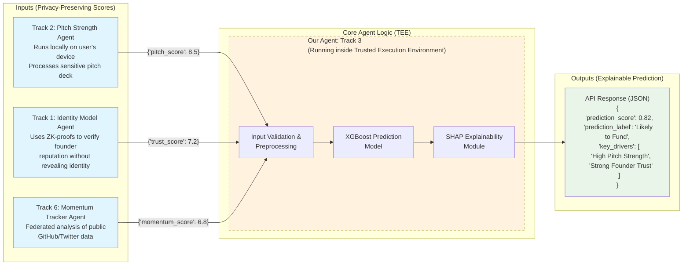

# Project Chimera: Fundraise Prediction Agent Architecture

This document contains the architecture diagram for Project Chimera.

## Mermaid Diagram Code

## Architecture Description

### Column 1: Inputs (Privacy-Preserving Scores)
- **Track 2: Pitch Strength Agent**: Runs locally on user's device, processes sensitive pitch deck
- **Track 1: Identity Model Agent**: Uses ZK-proofs to verify founder reputation without revealing identity  
- **Track 6: Momentum Tracker Agent**: Federated analysis of public GitHub/Twitter data

### Column 2: Core Agent Logic (TEE)
- **Our Agent: Track 3**: Running inside a Trusted Execution Environment (TEE)
  - Input Validation & Preprocessing
  - XGBoost Prediction Model
  - SHAP Explainability Module

### Column 3: Outputs (Explainable Prediction)
- **API Response**: JSON format with prediction score, label, and key drivers

## Key Design Principles

1. **Privacy-Preserving**: Only processes sanitized numerical scores, never raw sensitive data
2. **Secure Execution**: Runs within a TEE to ensure data and model confidentiality
3. **Explainable**: Uses SHAP to provide transparent reasoning for predictions
4. **Integration Ready**: Clean API interface for seamless platform integration
